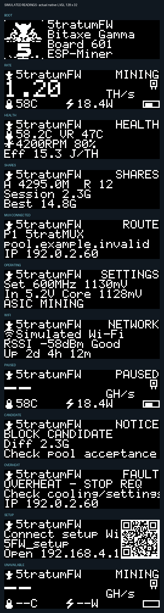

# BETA 1 validation record

**Version: `5tratumFW-0.1.0-beta.1` — BETA / GitHub prerelease.** Checked on 7 October 2026.

This record describes compilation, host regression tests and simulated rendering. **This BETA has not been installed on a miner.** Supported identities are Bitaxe Gamma PCB **601** and **602** only; see [compatibility](compatibility.md).

The firmware was compiled from source commit `0a8d9485e67065afd7005fd987d7010d33fd45e3`. The release/source archive commit also includes this documentation and packaging workflow updates; `manifest.json` records both commits. The application source and compiled web interface were unchanged by those documentation/workflow edits.

## Results

| Check | Result |
| --- | --- |
| Production Angular build, regenerated OpenAPI client, gzip assets | Passed with Node 24.14.0/npm 11.9.0. |
| Frontend Karma/Jasmine suite | **105 passed**, Chrome Headless 154 on macOS. Includes the WillItMod BETA update channel and paired-image filtering. |
| Responsive production-bundle browser QA | **36/36 passed** across Dashboard, Pool routing, Scheduler, Miner controls and Updates at 1440×1000 and 390×844; all API traffic mocked, no device writes/external calls or browser errors. |
| Gamma boot/settings production-C tests | **12 passed**: 601/602 identity guard, NVS preservation/error behavior, saved operating point and Coinbase defaults. |
| Production hashrate display regression | **1 passed** under ASan/UBSan: first/accepted/ignored/future/stale samples and reset; counter arithmetic/publication retained. |
| Production power-control runtime | **11 passed**. |
| Weekly schedule policy | **8 passed**. |
| Scheduler/API runtime | **10 passed** using pinned SDK cJSON and fake storage/time/HTTP. |
| Production MUX parser/lifetime/dispatch/timing/subscribe | **5 scenarios passed** under ASan/UBSan. Reserved messages do not affect shares/timing; strict types, 512-byte bound, 90-second expiry, renewal, connection generation and lock/clock ordering checked. |
| Native production OLED layout | **27 actual 128×32 LVGL 9.3 I1 views passed**, ASan/UBSan; sample data only. |
| Production `screen.c` runtime harness | Passed: startup/carousel, complete long self-test recovery, self-test/ASIC failure priority, safety warnings, pause transitions, stale positive rates and MUX fallback isolation. |
| ESP32-S3 application and WWW target build | Passed in pinned ESP-IDF v5.5.3 Linux ARM64 container on macOS ARM64. |
| Application BIN | **1,697,168 bytes**,59.54% of its 4 MiB application partition free. App descriptor confirms BETA version and ESP-IDF v5.5.3. |
| WWW partition image | **3,145,728 bytes**: full 3 MiB SPIFFS image. |
| Compressed web assets | **614,867 bytes**,19.55% of WWW capacity; 876,628-byte project budget passed. This payload measure excludes filesystem metadata. |
| Source/credentials audit | Reviewed tracked source only; private-device directories, device tools, generated build outputs and caches excluded. Upstream GPL and third-party notices retained. |

The host runner executed all **six** entry points. Native rendering also executes the production screen runtime harness. [Build instructions](build.md) reproduce the pipeline with the pinned SDK image, Node version, npm/component lockfiles and secp256k1 submodule. Package verification independently regenerates SPIFFS and compares the hash with `www.bin`; `SHA256SUMS` covers both OTA images and corresponding source.

The frontend emits an advisory warning for its uncompressed initial browser bundle (~2.21 MB versus 2.10 MB warning budget). The compressed on-device payload passes its separate enforced flash budget. ESP-IDF also reports inherited unused-static-function warnings in upstream/SDK code; the target build completes.

## Installed-device evidence and remaining checks

An earlier **`5tratumFW-0.1.0-a1`** app/WWW pair booted and mined on a Gamma 601 with its saved 525 MHz / 1150 mV operating point retained. That historical observation does not validate this BETA. The observed Gamma 602 still runs stock v2.14.2 and has not been flashed with 5tratumFW. Those values are observations, not recommended clock/voltage presets; preserve each device's own values.

Physical checks remain pending for this BETA: boot and accepted shares on each revision, actual OLED readability/refresh, real pause/resume and weekly windows, thermal/protection behavior, compatible OTA/settings preservation and recovery. The API operating-settings export is not a full NVS/credential backup.

The matching MUX server status extension is **undeployed**. No live end-to-end status advertisement, upstream routing or payout claim is made. An older MUX can mine without the new OLED MUX label. Advertisements are informational, expire after 90 seconds, and require the actual current peer. Per-chip independent work, autotuning, clock presets and authenticated native MUX controls are not implemented or validated.

No hub deployment or miner flashing was performed while preparing this repository or its BETA package.

## Simulated OLED preview

The following image is generated by the native production renderer. All readings and operating settings are **fixtures**, not a device observation or a suggested configuration. Font attribution is in [third-party notices](third-party-notices.md).

